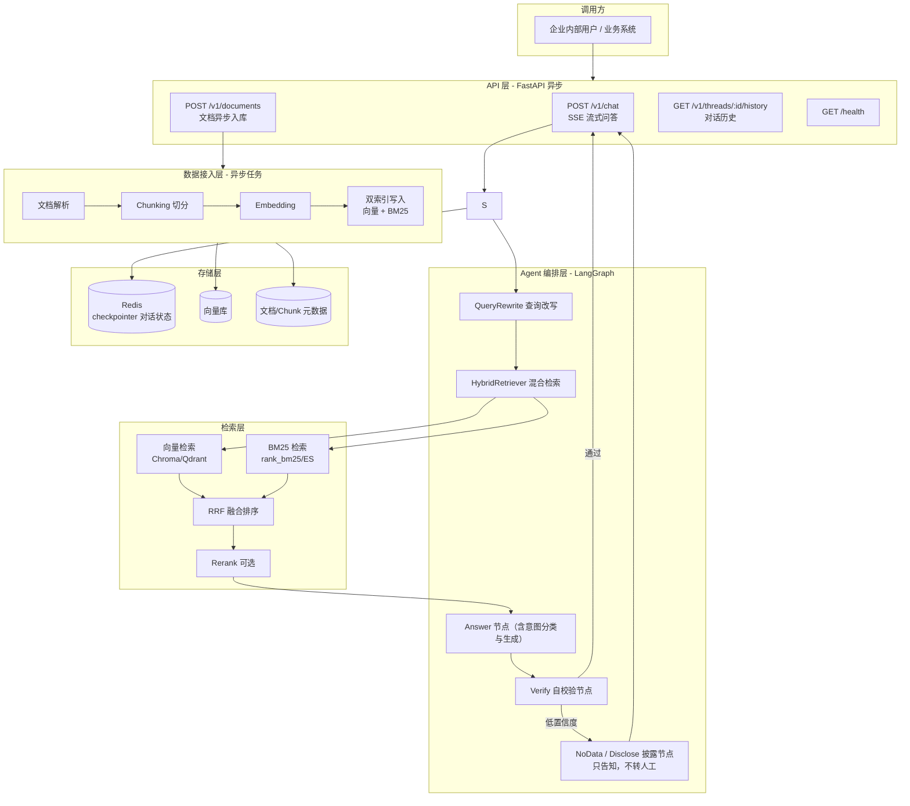
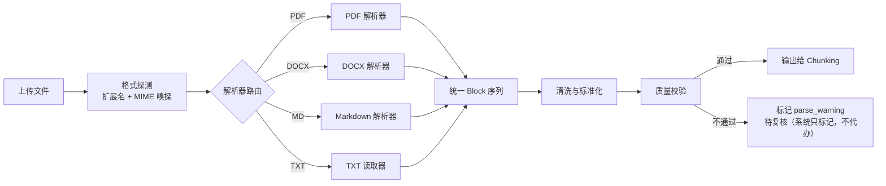
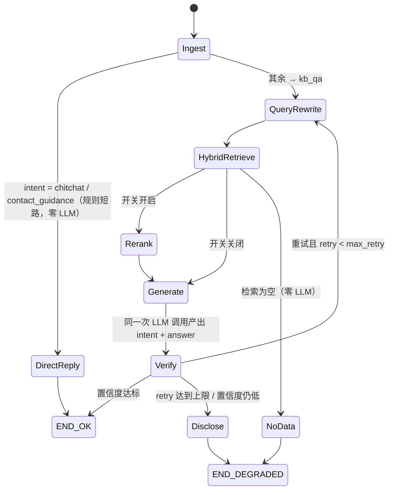

# 企业级智能问答 Agent — 开发需求文档

| 项目 | 内容 |
|---|---|
| 文档版本 | v1.8 |
| 创建日期 | 2026-09-08 |
| 更新记录 | v1.8（2026-09-14）：**删除「转人工」出口——系统只做检索与披露**——① 删除 `handoff` 节点与 `_HANDOFF_MSG`（"已为你转接人工客服"是与现实不符的承诺，系统并无人工座席，也不该由本系统转交）；② 意图词表由 3 值收为 `kb_qa` / `chitchat` / `contact_guidance`——"要求转人工"只走规则短路返回"该找谁"的指引话术，LLM 不再拥有该枚举（找谁不由模型决定）；③ `retrieve` 后新增**空检索短路 → `no_data`（0 次 LLM）**：如实告知资料缺失并指向管理员录入，取代旧设计"白烧 answer+verify 两轮再转人工"；④ verify 重试用尽改走 **`disclose`**：保留答案 + 确定性追加"仅供参考、以原文为准"后缀（无 citation 时改用不可采信提示），不再转人工；⑤ 修复流式不变式——`stream_answer` 不再对正文做 `strip` / 标签替换（会破坏"token 拼接 == done.answer"），改为首块 lstrip + 逐块原样推送，`disclose` 后缀经 token_sink 补发；⑥ 重试 hint 由"请补充引用使校验通过"（诱导堆砌/伪造引用）改为"如实说明资料不足与来源，不要编造"；⑦ 回归 m3 25→**34**、sse 12→**16**，m1/m4/m6/token 全绿；⑧ 同步 README / deployment / api-contract 与本文档（架构图、状态图、F3.1/F3.3/F3.6/F3.7 需求行、QAState 枚举）。<br>v1.7（2026-09-12）：**SSE 流式 + supervisor 意图分类合并进 Answer 节点 + 换 Qwen3.8-Flash**——① 删除独立 `supervisor` 节点，意图分类合并进 `answer` 节点（同一次 LLM 调用产出 intent+answer），kb_qa 单问 LLM 往返由 3 次降至 2 次；明确寒暄/转人工由 `rule_classify_intent` 规则短路（零 LLM）；② 模型由 qwen3.8-max 换 `Qwen3.8-Flash`（北京后付费 0.0008/0.0027 CNY·1K，同 token 量约 max 档 4.3%）；③ SSE 流式首行 `<intent>` 标签在流式期间解析用于路由、推前端前剥离；④ 需求文档 F3.1 同步改为「意图分类（已合并进 Answer 节点）」，架构图移除 Supervisor 节点；⑤ 文档同步 README / deployment / api-contract。<br>v1.6（2026-09-12）：**首次在真实 DashScope 向量下跑通完整评估，并修复三处缺陷**——① 评估实测（`qwen3.7-text-embedding-flash` / 1024 维 / 语料 38 文档 105 chunk）：**recall@5=0.855、MRR=0.791**，55 条全评估、0 条锚句未命中，verdict=**pass**；对比同语料 BM25 单路 0.836 / 0.673，RRF 融合净增益 +0.019 / +0.118，证实向量路对 noisy（口语改写 0.000）与 exact（数字编号 0.750）两块短板的补偿价值。② **修复 `ingest --rebuild` 静默清空索引**（P0）：旧实现 `old_version = version if rebuild else version-1`，在 `action=="new"` 时 `old_version` 恰等于刚写入的版本 → 全部新块被自身翻成 `is_valid=false`，检索静默返回空（实测 105 行 is_valid 全 0、55 条锚句 0 命中）；改为「同 hash 也强制 bump 版本重灌，只失效上一版本」（`_decide(force=True)`），`verify_m1.py` 增 4 条回归断言（41→45）。③ **修复 M5 观测阈值失效**：`log_slow_query` / `log_llm_call` / `log_ingest` 原本无条件 `_emit_slow`，低于阈值也记 WARN（实测 26ms < 500ms 仍刷屏 55+ 行），且 `hybrid.retrieve` 中 `TimedSpan.stop()` 与显式调用**重复记两条**；现改为仅 `duration_ms ≥ 阈值` 落日志并统一走单次记录。④ **修复 `.env` 内联注释陷阱**：python-dotenv 只剥离「值非空」时后随注释，`SERVICE_API_KEY=` 后直接跟 `#` 会把注释整段当密钥 → 意外开启鉴权、接口全 401（`verify_m4` 因此失败）；`.env.example` 与手册已改为注释独立成行。<br>v1.5（2026-09-12）：① **评估语料扩充完成**——`data/samples` 由 5 文档 / 11 chunk 扩至 **38 文档 / 105 chunk**，top-5 覆盖率由 45.5% 降至 **4.8%**，recall@5 首次具备区分度；② 新增 `scripts/make_corpus_long.py`（长文档批次，共 20 份，含 HR/财务/IT/售后各域的强干扰文档）、`scripts/corpus_stats.py`（语料规模与切分分布体检）、`scripts/bm25_probe.py`（**无需 API Key** 的 BM25 离线召回探针，输出 recall@k / MRR 并按 golden `type` 分组，弥补主评估只报总分）；③ 修复 PDF 生成缺陷——`insert_font(fontfile=)` 中文字体整包嵌入致单文件 9.7MB，改 `subset_fonts()` 后降至约 30KB；④ BM25 单路下界 recall@5=0.836 / MRR=0.673；⑤ Backlog「语料侧待做」条目结项。——`data/samples` 由 5 文档 / 11 chunk 扩至 **38 文档 / 105 chunk**，top-5 覆盖率由 45.5% 降至 **4.8%**，recall@5 首次具备区分度；② 新增 `scripts/make_corpus_long.py`（长文档批次，共 20 份，含 HR/财务/IT/售后各域的强干扰文档）、`scripts/corpus_stats.py`（语料规模与切分分布体检）、`scripts/bm25_probe.py`（**无需 API Key** 的 BM25 离线召回探针，输出 recall@k / MRR 并按 golden `type` 分组，弥补主评估只报总分）；③ 修复 PDF 生成缺陷——`insert_font(fontfile=)` 中文字体整包嵌入致单文件 9.7MB，改 `subset_fonts()` 后降至约 30KB；④ BM25 单路下界 recall@5=0.836 / MRR=0.673；⑤ Backlog「语料侧待做」条目结项。<br>v1.4（2026-09-12）：① F7.1 golden 集由 13 条扩至 **55 条**（新增「改写稳健」「噪声」两类），并新增 `scripts/verify_golden_anchors.py` 做锚句可定位性体检（55/55）；`verify_m6.py` 的锚句定位断言由「≥80%」收紧为 **100% 零容忍**；② 记录**语料规模局限**（data/samples 仅 11 chunk，recall@5 区分度不足，语料扩充转入 §12 Backlog）；③ §12 Backlog 更新条目状态；④ 同步实现修复：`parsers._read_text` 统一 CRLF/CR → LF（Windows 纯文本不再被当成单一段落，也消除 C0 控制符导致的「疑似乱码」误报）。<br>v1.3（2026-09-10）：同步契约 v1.3 与实现——① §1.3 非目标改为「不做独立前端工程，但附带零构建静态调试客户端 web/（M7）」；② §5 性能 NFR 标注真实基线 16.8s 与优化路径；③ §6.1 SSE 示例 citation 补 doc_date/image_ids；④ 开发计划 §9、验收 §10 补 M7。<br>v1.2（2026-09-09）：吸收 doc-agent 项目已验证的工程实践——新增 F1.9 PDF 质量门与 VLM 转录、F1.10 图片引用链路、F2.9 年份感知召回、F7 评估体系；7.1 元数据扩展（doc_date/doc_year/image_ids）；风险清单与验收标准同步扩充（详见 `docs/doc-agent-absorption.md`） |
| 项目代号 | Enterprise-QA-Agent |
| 技术关键词 | RAG / 向量数据库 / BM25 混合索引 / LangGraph 多 Agent / FastAPI / 异步并发 |

---

## 1. 项目概述

### 1.1 背景

企业内部知识分散在 PDF、Word、Wiki、制度文档中，员工查询效率低。传统关键词搜索（BM25）无法理解语义，纯向量检索又对精确术语、编号、专有名词召回不稳。本项目构建一个**混合检索 + 多 Agent 编排**的企业问答系统，提供可追溯、带引用、可流式输出的问答服务。

### 1.2 目标

1. **混合索引检索**：向量语义召回 + BM25 关键词召回，RRF 融合排序，兼顾语义理解与精确匹配。
2. **多 Agent 协作**：基于 LangGraph 实现意图分类（合并进 Answer 节点）、查询改写、检索、生成、自校验的分工流水线。
3. **生产级 API**：FastAPI 全异步接口，支持 SSE 流式输出、文档异步入库、并发限流。
4. **可解释、可兜底**：回答附引用来源；低置信度自动降级（如实告知资料缺失 / 披露局限），死循环防护；**系统只做检索与披露，不发起转人工、建工单、指定责任人等升级动作**。

### 1.3 非目标（Out of Scope）

- 不做用户权限体系（RBAC）的完整实现，仅预留 tenant_id 字段做数据隔离。
- 不做独立前端工程；但附带一个零构建纯静态调试客户端（`web/`，M7），仅用于本地联调与演示，不计入产品前端。
- 不追求微调模型，全部基于通用 LLM + 检索增强。

---

## 2. 技术栈选型

| 层级 | 技术 | 说明 |
|---|---|---|
| Agent 编排 | **LangGraph** | StateGraph 定义多 Agent 节点与条件边，checkpointer 持久化对话状态 |
| LLM / Embedding | **Qwen（DashScope 兼容接口）** | qwen-plus / qwen-max 生成，text-embedding-v3 向量化；接口层抽象，可替换 |
| 向量数据库 | **Chroma**（起步）→ Qdrant（可替换） | 本地持久化起步，接口抽象便于切换生产级向量库 |
| BM25 | **rank_bm25**（起步）→ Elasticsearch（可替换） | 纯 Python 实现起步；语料增大后切换 ES |
| 融合排序 | **RRF（Reciprocal Rank Fusion）** | k=60，无需归一化分数，工程上最稳 |
| Rerank（可选） | bge-reranker / Qwen rerank | 融合后再精排，作为可开关的增强项 |
| API 框架 | **FastAPI + Uvicorn** | 全异步路由，SSE 流式响应，自动 OpenAPI 文档 |
| 异步并发 | **asyncio / httpx (async) / asyncio.Semaphore** | 异步 IO、并行检索、并发限流 |
| 状态持久化 | **Redis + langgraph-checkpoint-redis** | 多轮对话记忆，thread_id 维度隔离 |
| 数据校验 | **pydantic v2** | 请求/响应模型、Agent 结构化输出 |
| 文档解析 | PyMuPDF / python-docx / markdown 轻量自研 / 编码探测 | PDF、Word、Markdown、TXT 解析（PyMuPDF 为 F1.9 质量门必需，见 F1.1 说明） |

---

## 3. 系统架构

### 3.1 总体架构图



### 3.2 模块划分

| 模块 | 职责 |
|---|---|
| `app/api/` | FastAPI 路由、请求校验、SSE 推送、异常处理 |
| `app/agents/` | LangGraph 图定义、各 Agent 节点实现 |
| `app/retrieval/` | 向量检索器、BM25 检索器、RRF 融合、rerank |
| `app/ingestion/` | 文档解析、chunking、embedding、索引构建（异步任务） |
| `app/core/` | 配置、日志、LLM client 封装、并发限流器 |
| `app/models/` | pydantic 模型（API 模型 + Agent 结构化输出模型） |
| `data/` | 原始文档、Chroma 持久化目录 |

---

## 4. 功能需求

### F1 文档入库 Pipeline（异步）

| 编号 | 需求 | 优先级 |
|---|---|---|
| F1.1 | 支持 PDF / DOCX / MD / TXT 上传，多格式解析为统一 Block 序列（详细设计见下方 F1.1 小节） | P0 |
| F1.2 | Chunking：基于 Block 边界做递归切分，chunk_size=512 tokens，overlap=80；**table / code 块整块保留不切断**；chunk 携带完整元数据（Schema 见 7.1） | P0 |
| F1.3 | 批量调用 Embedding 接口（异步 + 批大小控制 + 限流退避） | P0 |
| F1.4 | **双索引写入**：同一批 chunk 同时写入向量库与 BM25 语料，保证两边 doc 集合一致 | P0 |
| F1.5 | 入库任务异步执行（FastAPI BackgroundTasks 或独立 task queue），接口立即返回 task_id，可查询进度 | P0 |
| F1.6 | 支持按 doc_id "删除"文档：**软删除**——仅将 chunk 的 `is_valid` 置为 false，检索时过滤，向量库不做物理删除 | P1 |
| F1.7 | **向量库 Append-Only**：不做物理 delete / update，删除走软删除、更新走版本化软更新，避免 HNSW 索引墓碑效应（详细设计见下方 F1.7 小节） | P0 |
| F1.8 | **幂等入库**：文件级 hash 去重 + chunk 级确定性 ID + 任务断点续跑，重复上传 / 任务重试不产生重复数据（详细设计见下方 F1.8 小节） | P0 |

#### F1.1 文本解析详细设计

**解析流水线**



**各格式解析策略**

| 格式 | 解析器 | 抽取内容 | 要点与边界情况 |
|---|---|---|---|
| PDF-文本型 | PyMuPDF（版面定位 + 质量门信号 + 整页渲染均依赖它） | 逐页文本 + 页码 | 选型说明：F1.9 质量门需版面级文本统计与页级图片/渲染能力，pypdf 不满足（doc-agent 同款选型）；双栏排版按单栏抽取会串行，M2 视需接 pdfplumber layout 模式 |
| PDF-表格 | pdfplumber | 表格 → Markdown 表格 | **整个表格保留为一个 Block**，不拆行，防止 chunking 把表头与数据切断 |
| PDF-扫描件 | 质量门判级 + VLM 转录（见 F1.9） | 红页（乱码/纯图）→ Qwen-VL 整页转录为 `figure_transcript` 块 | **红页乱码原文不产块**（防污染检索，doc-agent 实证）；OCR（rapidocr-onnxruntime）保留为 P1 兜底 |
| PDF-图文混排 | PyMuPDF + 图片抽取 | 文本 + `[IMAGE:{image_id}]` 占位 Block | 图片引用链路见 F1.10（占位符随块入库 + 图片仓库 + 召回回填）；图内文字由 VLM 转录覆盖（F1.9） |
| DOCX | python-docx | 段落 + 标题样式层级 + 表格 | Heading 1~3 样式映射为 section 层级；表格同样整块保留 |
| MD | markdown-it-py | 标题层级 + 正文 + 代码块 | 代码块整块保留；图片语法转 image 占位 Block |
| TXT | 直接读取 | 纯文本 | chardet 探测编码（utf-8 / gbk），探测失败按 utf-8 + errors=replace 兜底 |

**统一中间结构**（所有解析器输出统一模型，下游 chunking 不感知文件格式）

```python
class Block(BaseModel):
    block_type: Literal["heading", "paragraph", "table", "image", "code"]
    text: str                        # table 为 Markdown 表示，image 为占位描述
    page: int | None = None
    heading_level: int | None = None  # 1~3，用于 section 层级追踪
    metadata: dict = {}               # 图片路径、表格行列数等
```

**清洗与标准化规则**

| 规则 | 说明 |
|---|---|
| 页眉页脚去除 | 同一行文本连续 ≥3 页出现在页首/页尾 → 判定为页眉页脚，剔除 |
| 空白归一 | 连续空行压缩为一行；行内多个空格合并 |
| 断行修复 | PDF 按行抽取产生的硬换行：paragraph 块内换行合并（中文场景合并时去除空格，英文场景替换为单空格） |
| 乱码检测 | 替换符（�）与控制字符占比 > 1% → 标记 parse_warning |
| 长度校验 | 全文 < 100 字符 → 疑似空文档/扫描件漏检，标记待人工确认 |

**边界与异常处理**

- 单页/单块解析失败不阻断整个文档：记录失败位置，其余继续，任务报告中体现
- 加密 PDF：直接标记任务失败，错误码 `DOC_ENCRYPTED`
- 重复上传：以 `doc_key` + `content_hash` 双层判定——同 doc_key 同 hash → 幂等跳过（见 F1.8 小节）；同 doc_key 不同 hash（内容变更）→ 版本化软更新（见 F1.7 小节），旧版本批量置 `is_valid=false`
- **解析器可插拔**：所有解析器实现统一接口 `parse(file_path) -> list[Block]`，新增格式只加解析器，不动下游

#### F1.7 软删除与版本化详细设计（向量库 Append-Only）

**背景**：HNSW 类向量索引（Qdrant / Milvus / Chroma）物理删除会在图结构中留下**墓碑节点**（tombstone），频繁 delete/update 会导致：① 图连通性受损、召回率缓慢下降；② 索引体积只增不减；③ 被迫高频重建索引。update 在底层等价于 delete + insert，同样产生墓碑。因此向量库一律 **只增不删不改**。

**操作规则**（字段语义以 7.1 元数据 Schema 为准：有效性用 `is_valid` 表达，版本用 `version` 表达）

| 操作 | 实现方式 |
|---|---|
| 新增 | 正常插入，`is_valid=true`，version = 当前文档版本 |
| 删除文档 | **软删除**：该 doc 全部 chunk 的 `is_valid` 置为 `false`，物理数据保留 |
| 更新文档 | **版本化软更新**：doc `version + 1`，新版本 chunk 全量新插入，旧版本 chunk 批量置 `is_valid=false` |
| 查询 | 检索时强制 metadata filter：`is_valid=true`，无效数据不参与召回 |

**chunk_id 带版本段**：`chunk_id = doc_id + version + 序号`（如 `doc_xxx_0002_0005`）。Append-Only 下旧版本数据永不物理删除，若 chunk_id 不含版本段，新版本会与旧版本 chunk_id 冲突——版本段是硬约束。

**状态机**

```
  version v, is_valid=true（新增）
     ├─ 删除 ────────────────► is_valid=false（终态）
     └─ 内容变更 → version+1
          新版插入 is_valid=true
          旧版批量翻 is_valid=false（终态，仅离线重建物理清除）
```

**一致性要求**

- `is_valid` 在**向量库 payload 与 BM25 语料两侧同时维护**，过滤条件双侧一致，保证两路召回集合对齐
- 软更新以 doc_id 为单位批量翻状态，需保证原子性：**先插入新版本，再翻旧版本**，避免检索空窗
- Chroma 阶段：`where={"is_valid": True}`；切 Qdrant/ES 后对应 filter query，接口层屏蔽差异

**代价与对策**

软删除数据持续积累，带来存储膨胀与过滤开销。对策：**监控 `is_valid=false` 数据占比，超过阈值（默认 30%）触发离线重建**——低峰期建新索引 → 蓝绿切换 → 物理清除旧数据（见第 12 节 backlog）。在线路径永远不做物理删除。

#### F1.8 幂等入库详细设计

**目标**：同一数据无论上传多少次、入库任务重试多少次，索引中始终只有一份有效数据（exactly-once 效果），且不产生重复的 embedding 调用。

**身份与变更指纹（先厘清两个概念，契约 §2.2 / §4.7 同规则）**

- `doc_key`：**内容无关的逻辑文档身份**。默认 = 规范化后的文件名；上传 `meta.doc_key` 可显式指定（如目录相对路径）。同一 doc_key 视为同一逻辑文档
- `doc_id`：由 `sha256(tenant_id + ":" + doc_key)` 派生——**与内容无关，跨版本稳定**。这是版本化软更新（F1.7）成立的前提：若 doc_id 随内容变化，内容一改就成了新文档，旧版本永远无法被"取代"
- `content_hash`：文件内容 SHA-256，仅作**变更指纹**与幂等检测，**不参与 doc_id 派生**

**三级幂等**

| 层级 | 幂等键 | 行为 |
|---|---|---|
| 文件级 | `doc_key`（身份）+ `content_hash`（指纹） | 见下方判定规则：同 doc_key 同 hash → 幂等跳过；同 doc_key 异 hash → 版本化更新 |
| 任务级 | doc_id + version | 任务失败重试时断点续跑：已完成的阶段（解析 / embedding / 写索引）不重做 |
| chunk 级 | chunk_id（doc_id + version + 序号，见 7.1） | 写入前查重：chunk_id 已存在（含 is_valid=false 的旧数据）→ 跳过 insert；embedding 复用按内容指纹（内部字段 content_hash）命中即不重复调用 |

**文档登记表（Doc Registry）**

入库前先查登记表（SQLite 或 Redis），状态机：

> 注：登记表状态与任务状态枚举一致（`pending / processing / done / failed`，见 `docs/api-contract.md` §2.3）；它属于**任务执行状态**，与 chunk 的业务有效标记 `is_valid`（7.1）是两个维度，勿混用。

```
  doc_key 不存在注册       入库成功              失败（可重试）
 ──────────────► processing ──► done
                      │
                      └──────────► failed ──重试──► processing
```

判定规则（Registry 主键 = `(tenant_id, doc_key)`，content_hash 只作变更指纹）：

| 场景 | 处理 |
|---|---|
| doc_key 不存在 | 新建文档（version=1）：注册 processing → 入库 → done |
| 同 doc_key 同 content_hash 且 status=done | 幂等返回（HTTP 200 + duplicated=true + 已有 doc_id），不重复处理 |
| 同 doc_key 同 content_hash 且 status=processing | 并发冲突：返回 409 `INGEST_IN_PROGRESS`，不重复启动任务 |
| 同 doc_key 同 content_hash 且 status=failed | 允许重试，断点续跑 |
| 同 doc_key 不同 content_hash（内容变更） | 走 F1.7 版本化软更新：version+1 新版本插入，旧版本批量置 `is_valid=false`（doc_id 不变） |
| 不同 tenant | 天然隔离：判重维度是 `(tenant_id, doc_key)`，各租户独立入库 |

**chunk 级去重的收益**

- **断点续跑**：任务中途失败（网络抖动、限流），重试时已完成 chunk 直接跳过，embedding 不重复调用——省 token 费用，也避免触发上游限流
- **双索引写一致性**：向量库与 BM25 两侧任一写入失败，重试不会造成另一侧出现重复 chunk
- 与 F1.7 的衔接：幂等只管"完全相同的数据不重复进"；数据发生变化时走版本化，两条路径互不干扰

#### F1.9 PDF 质量门与红页 VLM 转录详细设计（吸收自 doc-agent）

**背景**：PDF 文本层不可用时（坏字体乱码、纯图扫描），盲信原文入库只会污染检索——乱码块被召回后答案必然出错。doc-agent 实证：与其用"页文本长度 < 阈值就 OCR"的单一判定，不如**零成本规则信号先行判级，红页再走 VLM 慢路径**。

**红/黄/绿三档判级**（逐页执行，全部零 LLM 成本，阈值可调）：

| 档 | 含义 | 处置 |
|---|---|---|
| 红 | 文本不可信：乱码率超阈值、纯图页 | **不产块**，转 VLM 整页转录慢路径 |
| 黄 | 文本可用但版面复杂：少文字、含表格/图片 | 正常入库 + `parse_warning`；可选 MinerU 结构化（backlog） |
| 绿 | 正常 | 放行 |

**VLM 转录慢路径**：

1. 红页整页渲染（zoom=2）→ `qwen-vl-max`（失败降级 `qwen-vl-plus`）→ 产出 `block_type=figure_transcript` 块
2. 成本护栏：`VLM_MAX_PAGES_PER_DOC`（默认 20），超限页降级原文入库并记 `vlm_note`
3. 无 Key / 转录失败 → 该页降级为原文入库，报告标注，**编排不崩**
4. **红页乱码原文永不产块**——入库的都是可信文本或 VLM 转录文本

**与本项目版本化模型的衔接**：本项目 chunk_id 带版本段、内容变更走版本化软更新（F1.7），天然规避 doc-agent 曾踩的"转录块原位插入导致后续 block_seq 平移成孤儿 id"问题；**保留吸收的核心原则只有一条——红页乱码原文不产块**。

#### F1.10 图片引用链路详细设计（吸收自 doc-agent）

**哲学**：图片不进向量库（无多模态 embedding 通道、rerank 只吃文本，纯文本单通道自洽），但**不丢弃**——占位符保住上下文，仓库保住原图，召回后回填。

```
切块提取图片 ─▶ image_id = "{doc_stem}-{内容md5前10}"（内容幂等，同图重跑同 id）
   ├─▶ 文本原位写 [IMAGE:{image_id}] 占位符，随块文本入向量库（检索不丢上下文）
   ├─▶ 块 metadata.image_ids（Chroma 只收标量 → 逗号串），citations 透传
   └─▶ 图文件落 data/images/{doc_id}/ + 登记表（sqlite，INSERT OR IGNORE 幂等，永不推断删除）

召回后：citations.image_ids → 前端按 GET /api/v1/images/{image_id} 回填原图（契约 §2.8）
```

- 图内文字由 F1.9 VLM 转录覆盖（转录块与图片同页，语义检索即可命中）
- 孤儿图清理是业务层职责（与 F1.7 离线重建同一批处理）

### F2 混合检索

| 编号 | 需求 | 优先级 |
|---|---|---|
| F2.1 | 向量召回：top_k=20，按 cosine 相似度 | P0 |
| F2.2 | BM25 召回：top_k=20，中文需分词（jieba） | P0 |
| F2.3 | **两路检索并行执行**（asyncio.gather），单路失败不阻断整体（降级为单路结果 + 告警日志） | P0 |
| F2.4 | RRF 融合：score = Σ 1/(k + rank)，k=60，输出融合后 top_n=8 | P0 |
| F2.5 | 可选 rerank：对融合结果精排，配置开关，默认关闭 | P1 |
| F2.6 | 检索结果必须携带完整元数据用于引用展示 | P0 |
| F2.7 | 两路召回均强制元数据过滤：`is_valid=true`（软删除）+ `permission` 权限标签 + tenant_id 隔离，向量侧与 BM25 侧过滤条件保持一致；`category` / `department` 等业务字段过滤为可配项（默认关闭，字段定义见 7.1） | P0 |
| F2.8 | **时效过滤与过期文档处理**：默认只召回现行文档；过期文档不静默应用，命中时提示失效并交由用户决定是否查看（详细设计见下方 F2.8 小节） | P0 |

#### F2.8 时效过滤与过期文档处理详细设计

**字段语义约定**（消除单字段歧义，后续实现以此为基准）：

`effective_time` = 该版本内容的**有效期截止时间戳**（Unix 秒）。判定：`effective_time == 0` 或缺省 → 永久有效；`now <= effective_time` → 现行（valid）；`now > effective_time` → **已过期（expired）**。若后续需要"生效起始时间"，复用 `create_time` 或另加字段，**不要让单字段承载"生效 + 截止"双重语义**。

**两个独立的失效维度**（勿混用）：

| 维度 | 字段 | 含义 |
|---|---|---|
| 删除/被取代 | `is_valid=false` | 数据已下线或被新版本替代，**彻底不参与任何召回** |
| 日历过期 | now > `effective_time` | 内容仍归档可查，但**不可作为现行规则应用** |

**两级召回与提示流程**

```
用户提问
  │
  ├─ 主检索：is_valid=true + now <= effective_time（现行）
  │     │
  │     ├─ 现行资料足够 → 正常回答（过期文档完全不参与）
  │     │
  │     └─ 现行资料不足 → 二级候选：放宽 effective_time 条件
  │            │
  │            ├─ 无任何候选（含过期）→ 走 F3 降级路径（no_data：如实告知资料缺失，0 LLM，不转人工）
  │            │
  │            └─ 仅命中过期文档 → 不直接生成答案，回复：
  │                  "知识库中该主题的现行资料不足；找到相关文档，
  │                   已于 {失效时间} 过期，是否仍要查看？（内容可能不适用当前情况）"
  │                       │
  │                       ▼ 用户确认（include_expired=true / 自然语言确认）
  │                  带失效标注的答案（见下"回答约束"）
  │
  └─ 用户显式 include_expired=true → 主检索即含过期文档，但同样受"回答约束"
```

**回答约束（防止过期内容被当作现行规则应用）**

1. 答案引用过期 chunk 时，**必须**输出失效提示（如"⚠ 该信息来自已于 2025-07-01 过期的文档，仅供追溯"），且提示紧跟引用位置而非文末
2. 过期引用在 citation 事件中带 `"validity": "expired"` + 失效时间，前端可单独着色
3. Verify 节点对含过期引用的答案：`grounded` 按引用判定，但 **confidence 下调一档**；若整篇答案仅由过期文档支撑 → 直接 `degraded=true`，并在 done 事件提示"请以现行制度为准"
4. 过期文档只回答"过去是什么样的/历史追溯"类问题；涉及现行政策、流程、价格等 → Agent 必须说明已失效并引导查询现行版本

**实现要点**

- Chroma 侧过滤构造：`{"$and": [{"is_valid": True}, {"$or": [{"effective_time": {"$eq": 0}}, {"effective_time": {"$gte": now}}]}]}`——**永久有效文档写入时必须写 `effective_time=0`（字段不可缺失）**：多数向量库对"无该字段"的记录不匹配操作符过滤，字段缺失会被永久排除在召回外；BM25 侧在代码层保持同一条规则
- 二级候选在主检索判定"现行不足"后**顺序发起**（先知道主检索不足，才需要二级），只放宽 effective_time 条件，**不**放宽 is_valid / permission；实现上复用同一检索器，避免两套过滤逻辑漂移
- 过期提示走普通对话消息，**不需要 interrupt**（保持即时响应），与客服 Agent 的渠道约定一致

#### F2.9 年份感知召回（吸收自 doc-agent）

**与 F2.8 的语义区分**（勿混用，两个维度互补）：

| 维度 | 字段 | 回答的问题 |
|---|---|---|
| 现行性 | `effective_time`（F2.8） | 这份文档**还能不能用**（是否过期） |
| 期次 | `doc_date` / `doc_year`（F2.9） | 这份内容**属于哪一期**（2024 年报还是 2025 年报） |

**字段**：`doc_date`（文件名解析，`YYYY-MM-DD` 或 `YYYY`）、`doc_year`（int，供 `where` 过滤）进 7.1 元数据 Schema，入库时统一注入。

**两段式裁决**（防止跨年份报表张冠李戴）：

1. 恒做一次**不限年份语义检索**作为基准（零额外成本路径）
2. 问题含显式年份（正则收集全部年份 → `doc_year $in [...]`）→ 加一次年份过滤检索
3. **过滤命中与语义 top1 同 doc_id**（该主题在目标年份确有内容）→ 采用过滤结果
4. 过滤**跑题或为空**（如库只有 A 文档 2025 版、问"A 2024"会滤到 B 文档 2024）→ **回退语义结果 + note 明示**

> 坑（doc-agent 实证）：只看过滤结果"空/非空"不够——过滤命中**跑题主题**块时不触发降级且答非所问，**必须比对过滤结果与语义 top1 的 doc_id 一致性**。

**局限**：`doc_date` 源自文件名，标题无年份的文档无此键 → 自动走回退路径；相对时间词（"去年/最新一期"）初版不处理。上下文块头带「文档日期」，让模型自查年份错位。

### F3 多 Agent 编排（LangGraph）



| 编号 | 需求 | 优先级 |
|---|---|---|
| F3.1 | **意图分类（已合并进 Answer 节点）**：由 Answer 节点在同一次 LLM 调用中一并产出意图（`kb_qa` / `chitchat`，pydantic Literal 枚举，temp=0）；明确寒暄 / 要求转人工由 `rule_classify_intent` 规则短路（零 LLM） | P0 |
| F3.2 | **QueryRewrite 节点**：结合对话历史把指代/省略问题改写为独立查询；无历史时透传 | P0 |
| F3.3 | **Retrieve 节点**：调用 F2 混合检索；**结果为空 → 直接转 NoData（0 次 LLM）** | P0 |
| F3.4 | **Answer 节点**：基于检索结果生成回答，强制引用格式 `[来源: 文档名 页码]`；prompt 中明确"资料不足就直接说明"且**不建议转人工** | P0 |
| F3.5 | **Verify 节点**：自校验——答案是否被引用内容支撑、是否覆盖问题要点，输出置信度分数（pydantic 结构化输出） | P0 |
| F3.6 | **死循环防护**：retry 计数写入 state，max_retry=2，超限走 Disclose（保留答案 + 披露局限），**不转人工** | P0 |
| F3.7 | **披露节点（NoData / Disclose）**：NoData 如实告知资料缺失并指向管理员录入；Disclose 保留答案并追加"仅供参考、以原文为准"的后缀。二者均只做文本告知，标记 `degraded=true`，**不发起转交 / 工单** | P0 |
| F3.8 | 确定性逻辑（重试次数、置信度阈值判断、空检索短路）写在图的条件边里，**不让 LLM 决定流程走向** | P0 |
| F3.9 | 过期文档引用约束：Answer 引用过期 chunk 必须输出失效提示（见 F2.8 回答约束）；Verify 对含过期引用的答案 confidence 下调一档，纯过期支撑 → degraded=true | P0 |

### F4 对话记忆

| 编号 | 需求 | 优先级 |
|---|---|---|
| F4.1 | Redis checkpointer 持久化 LangGraph state，thread_id = tenant_id + user_id 维度 | P0 |
| F4.2 | 支持多轮对话：历史消息进入 QueryRewrite 与 Answer 的上下文 | P0 |
| F4.3 | 历史窗口控制：最多保留最近 10 轮，超出截断，防止 token 膨胀 | P0 |

### F5 API 接口

| 编号 | 需求 | 优先级 |
|---|---|---|
| F5.1 | `POST /v1/chat`：SSE 流式输出，事件序列 `ready` / `token` / `citation` / `done` / `error` / `ping`（契约 2.1） | P0 |
| F5.2 | `POST /v1/documents`：multipart 上传，返回 task_id | P0 |
| F5.3 | `GET /v1/tasks/{task_id}`：查询入库任务状态 | P1 |
| F5.4 | `GET /v1/threads/{thread_id}/history`：对话历史 | P1 |
| F5.5 | `GET /health`：健康检查（含 Redis、向量库连通性） | P0 |
| F5.6 | 统一异常处理：业务错误返回结构化 error body，不暴露堆栈 | P0 |
| F5.7 | `DELETE /v1/documents/{doc_id}`：软删除文档（对应 F1.6，重复删除幂等返回 204） | P1 |
| F5.8 | `POST /v1/debug/retrieve`：检索调试（返回双路明细 + RRF 融合结果，仅供开发） | P1 |

### F6 异步与并发

| 编号 | 需求 | 优先级 |
|---|---|---|
| F6.1 | 所有 IO（LLM 调用、检索、Redis）使用 async 客户端，禁止在 async 路由中调用阻塞 SDK | P0 |
| F6.2 | LLM 外部调用封装为 async httpx client，带连接池、超时（connect 5s / read 60s）、指数退避重试（最多 3 次） | P0 |
| F6.3 | 并发限流：asyncio.Semaphore 控制对 LLM/Embedding 接口的并发度（默认 10），防止触发上游限流 | P0 |
| F6.4 | 向量检索与 BM25 检索并行执行（asyncio.gather） | P0 |
| F6.5 | 文档入库为后台异步任务，不阻塞上传接口 | P0 |

### F7 评估体系（吸收自 doc-agent M4）

| 编号 | 需求 | 优先级 |
|---|---|---|
| F7.1 | **golden 集**：`data/golden/qa_golden.json`，每条 `query → 期望文档 + 锚句`；锚句归一化子串匹配全库定位期望块集合（零人工标注成本）；缺字段/重复 id/锚句过短 → 校验失败不跑 | P0 |
| F7.2 | **检索层指标**：recall@5（至少一个期望块进 top-k 的用例占比）+ MRR；锚句定位失败的缺陷用例不计指标分母 | P0 |
| F7.3 | **答案层指标**（可选，需真 Key）：逐条跑问答链路，校验**引用可回查率**——`citations.chunk_id` 必须属于检索命中块 | P1 |
| F7.4 | **门槛判定**：真实向量 recall@5 ≥ 0.8；mock 向量无语义 → 只保链路、指标 SKIP 并标注 degraded | P0 |
| F7.5 | 报告落盘 `data/reports/eval_report_latest.json`（含 provider / degraded 标注，以及 `cost`（token/价格）、`latency`（p50/p95）、`verify`（verify 首过率/重试次数）三个聚合块；逐题含 `llm_calls` / `retries` / `verified`）；CLI 入口 `python -m app.cli eval [--answers] [--limit N]`，与 API 同构。**评估 thread 带本次运行盐值**——否则固定 thread + Redis checkpointer 会残留上一轮历史，使 rewrite 规则短路失效、指标随"跑第几次"漂移 | P0 |

**为什么自研而非套 RAGAS**：golden 用锚句定位期望块，机制透明、可调试、无额外依赖；doc-agent 实证 13 条 golden 即可支撑门槛判定与回归（recall@5=1.0 / MRR=0.885 / 可回查率 100%）。本项目起步 13 条（覆盖语义类 / 精确编号类 / 跨年份三类问题），后续扩 50+。**该扩展已完成**：55 条（语义 / 精确编号 / 跨年份 / 改写稳健 / 噪声五类），真实向量实测 **recall@5=0.855 / MRR=0.791**（verdict=pass）；答案层引用可回查率需 `--answers` 走真实 LLM，尚未复测。

## 5. 非功能需求

| 类别 | 指标 |
|---|---|
| 性能 | 单问全链路 P95 ≤ 8s（**目标值**；当前真实 DashScope 基线约 16.8s，需落地并行 verify / 仅歧义时触发 rewrite 等优化方可达成，见 deployment §7）；流式首 token P95 ≤ 2s（检索+改写阶段） |
| 并发 | 单实例支撑 50 并发问答请求，无明显错误率上升（压测验证） |
| 可用性 | 单路检索故障可降级；LLM 调用失败重试后仍失败返回结构化错误 |
| 可观测性 | 结构化日志（请求级 request_id 贯穿 API→Agent→检索）；记录每次检索的召回数、融合耗时、LLM token 用量 |
| 安全 | API Key 走环境变量，不入库不入日志；tenant_id 数据隔离预留 |
| 可测试性 | 检索层可脱离 LLM 单测；Agent 图支持注入 mock LLM 做节点级测试 |

---

## 6. 接口设计

### 6.1 POST /v1/chat

> 本节仅列接口用途与示例；字段定义、枚举、错误码、校验规则的**唯一权威**见 `docs/api-contract.md`。

请求：

```json
{
  "thread_id": "tenant_a:user_001",
  "question": "年假可以跨年休吗？",
  "stream": true,
  "include_expired": false
}
```

SSE 事件流：

```
event: token
data: {"content": "根据《考勤管理制度》"}

event: citation
data: {"doc_title": "考勤管理制度.pdf", "page_num": 12, "chunk_id": "doc_a1_0001_0012", "validity": "valid", "doc_date": "2025-01-01", "image_ids": []}

event: citation
data: {"doc_title": "福利制度_2024版.pdf", "page_num": 3, "chunk_id": "doc_b2_0001_0003", "validity": "expired", "expired_at": 1751241600, "doc_date": "2024-01-01", "image_ids": []}

event: done
data: {"confidence": 0.86, "degraded": false, "latency_ms": 3200}
```

### 6.2 POST /v1/documents

> 上传存在三态响应（202 新任务 / 200 幂等命中 / 409 冲突），`meta.doc_key` 身份规则与完整字段定义见 `docs/api-contract.md` §2.2。以下仅为示例。

```
multipart/form-data: file + meta(JSON)
→ 202 Accepted
{
  "task_id": "ingest_9f3a",
  "doc_id": "doc_xxx",
  "version": 1,
  "status": "pending",
  "duplicated": false
}
```

### 6.3 统一错误体

```json
{
  "error": {
    "code": "RETRIEVAL_UNAVAILABLE",
    "message": "检索服务暂时不可用，请稍后重试",
    "request_id": "req_xxx"
  }
}
```

---

## 7. 关键数据模型

### 7.1 Chunk 元数据 Schema（检索过滤字段）

字段按用途分四组，与 where filter / 引用展示 / 运维排查一一对应（多租户场景追加 `tenant_id`）：

```jsonc
// ══════ 文档级标识：同一文档所有 chunk 共享 ══════
"doc_id": "doc_xxxx",            // 文档全局唯一 ID：由 sha256(tenant_id + ":" + doc_key) 派生，同逻辑文档跨版本稳定（F1.8）
"doc_title": "接口设计规范v2.3",  // 文档标题，用于引用展示
"source": "project_wiki",        // 来源：wiki / pdf / markdown / database / web
"file_path": "/docs/api.md",     // 文件路径或原始 URL，溯源用
"version": 2,                    // 文档版本号，F1.7 版本化软更新时递增
"author": "zhangsan",            // 作者（可选）
"doc_date": "2025-03-01",        // 文档日期（文件名解析 YYYY-MM-DD/YYYY），期次溯源（F2.9，可选）
"doc_year": 2025,                // doc_date 的年份 int，供 where 过滤（F2.9，有 doc_date 才写）

// ══════ chunk 位置信息：每个 chunk 各自不同 ══════
"chunk_id": "doc_xxxx_0002_0005", // 唯一 ID：doc_id + version + 序号（含版本段，跨版本不冲突）
"chunk_index": 5,                // 文档内第几个 chunk（int），用于取前后 chunk 做上下文拼接
"page_num": 12,                  // PDF 页码；文本文档填 0
"start_offset": 2450,            // 原文起始字符偏移，定位原文位置
"end_offset": 3120,              // 原文结束字符偏移
"image_ids": "img_a1-3f2c1b",    // 块内图片 ID 逗号串（Chroma metadata 只收标量），召回回填原图（F1.10，可为空串）

// ══════ 业务过滤字段：where filter 查询 ══════
"category": "技术文档",          // 分类：技术文档 / 运维手册 / 业务流程（string）
"department": "backend",         // 部门/业务域，多域知识库过滤用
"permission": "internal",        // public / internal / secret，检索时过滤无权限文档
"effective_time": 1751241600,    // 有效期截止时间戳（Unix 秒），0/缺省=永久有效；now 超期视为已过期（F2.8）
"is_valid": true,                // 有效标记（bool）：软删除=置 false，不做物理删除

// ══════ 运维属性 ══════
"create_time": 1751241600,       // 该 chunk 入库时间戳
"update_time": 1752341100,       // 更新时间戳
"embedding_model": "bge-m3",     // 使用的 embedding 模型，迁移排查用
"chunk_size": 512                // 实际切分大小，调优排查用（与 F1.2 配置一致）
```

**机制映射**（本文档各机制如何落到这套字段上）

| 机制 | 字段表达 |
|---|---|
| 软删除（F1.7） | chunk_id 不变，`is_valid=false`，物理保留 |
| 版本化软更新（F1.7） | `version + 1`，新版本 chunk 新插（chunk_id 含版本段），旧版本批量 `is_valid=false`；`version/update_time` 留审计与回滚重建 |
| 检索过滤（F2.7 / F2.8） | 必选：`is_valid=true` + `permission` + tenant_id；现行判定：`effective_time==0` 或 `now <= effective_time`（F2.8 时效语义）；可选：`category`、`department` |
| 幂等入库（F1.8） | `doc_key`（身份）+ `content_hash`（变更指纹）存 Doc Registry，**不入 chunk payload**；chunk 级以 chunk_id 查重 |
| block_type（解析产物，F1.1） | 解析 / chunking 阶段内部字段（table / code 整块策略用），默认不入检索 payload；如需按类型过滤可扩为可选字段 |
| 前后 chunk 上下文拼接 | 由 `chunk_id` 前缀相同 + `chunk_index` 相邻确定 |
| 年份感知（F2.9） | `doc_date`/`doc_year` 进溯源键；显式年份问题两段式裁决，citations 透传 `doc_date` |
| 图片回填（F1.10） | `image_ids`（逗号串 ↔ list 序列化）；citations 透传，前端按契约 §2.8 回填原图 |

**pydantic 映射**（检索命中后的 chunk 正文模型，供 QAState 的 RetrieveOutcome 引用）

```python
class Chunk(BaseModel):
    # 文档级
    doc_id: str
    doc_title: str
    source: Literal["wiki", "pdf", "markdown", "database", "web"] = "wiki"
    file_path: str
    version: int = 1
    author: str | None = None
    doc_date: str | None = None    # 文件名解析，期次溯源（F2.9）
    doc_year: int | None = None    # 供 where 过滤（F2.9）
    # chunk 位置
    chunk_id: str                # f"{doc_id}_{version:04d}_{index:05d}"
    chunk_index: int
    page_num: int = 0
    start_offset: int = 0
    end_offset: int = 0
    image_ids: list[str] = []      # 块内图片 ID（入库序列化为逗号串，F1.10）
    # 业务过滤
    category: str = "general"
    department: str | None = None
    permission: Literal["public", "internal", "secret"] = "internal"
    effective_time: int | None = None  # 有效期截止，None/0 = 永久有效（F2.8）
    is_valid: bool = True
    # 运维
    create_time: int
    update_time: int
    embedding_model: str
    chunk_size: int
    # 扩展（多租户 / 内部使用，默认不入检索 payload）
    tenant_id: str | None = None
    content: str                       # chunk 正文，检索命中后返回给生成节点
    embedding: list[float] | None = None  # 仅向量库持有，payload 不冗余存储
```

### 7.2 Agent State（LangGraph）

```python
class QAState(TypedDict):
    messages: Annotated[list[BaseMessage], add_messages]
    question: str                # 原始问题
    rewritten_query: str         # 改写后的独立查询
    intent: Literal["kb_qa", "chitchat", "contact_guidance"]
    retrieved: RetrieveOutcome   # 混合检索结果（valid_hits / expired_hits 双桶，见 api-contract 4.5）
    answer: str
    citations: list[Citation]
    confidence: float
    retry_count: int             # 死循环防护计数
    degraded: bool
```

### 7.3 Verify 结构化输出

```python
class VerifyResult(BaseModel):
    grounded: bool          # 答案是否被引用支撑
    coverage: float         # 0-1，问题要点覆盖度
    confidence: float       # 0-1，综合置信度
    reason: str
```

---

## 8. 关键设计决策

| 决策点 | 选择 | 理由 |
|---|---|---|
| 为什么混合索引 | 向量 + BM25 | 向量擅长语义泛化，BM25 擅长精确术语/编号/专名；企业文档两类 query 都大量存在，单一路径有明显短板 |
| 为什么 RRF 而非分数加权 | RRF | 向量分数与 BM25 分数量纲不同，加权归一化调参脆弱；RRF 只用排名，免调参、对分数分布不敏感 |
| 流程走向由谁决定 | 图的条件边（代码） | 重试次数、置信度阈值是确定性规则，交给 LLM 判断不可控；LLM 只产出结构化结果，分支逻辑在代码里 |
| 检索并行 | asyncio.gather | 两路检索无依赖，并行可把检索耗时从 t1+t2 降为 max(t1,t2) |
| Verify 节点 | 独立节点而非塞进 Answer | 生成与校验职责分离，校验可用更低 temp 独立评估；也方便单独迭代校验策略 |
| Chroma 起步 | 接口抽象 | 学习/原型阶段本地即可；抽象 VectorStore 接口，后续平移 Qdrant/ES 不改业务代码 |

---

## 9. 开发计划

| 里程碑 | 内容 | 产出 | 预估 |
|---|---|---|---|
| M1 | 项目骨架 + 文档解析 + chunking + PDF 质量门（F1.9）+ 双索引写入 | ingestion pipeline 可跑通，索引可查询 | 2~3 天 |
| M2 | 混合检索：向量召回 + BM25 召回 + 并行 + RRF 融合 | 检索模块 + 单测，给定 query 返回融合结果 | 2 天 |
| M3 | LangGraph 多 Agent：rewrite / retrieve / no_data / answer(合并意图) / verify / disclose + Redis checkpointer | 完整问答图，多轮对话可用 | 3 天 |
| M4 | FastAPI：SSE 流式、文档上传异步任务、限流、异常处理 | 可用 API 服务 | 2 天 |
| M5 | 压测 + 观测 + 文档 + README | 压测报告、部署说明 | 1~2 天 |
| M6 | 评估体系（F7）：golden 集 + recall@5/MRR + 引用可回查率 + 门槛判定 | eval CLI + 报告落盘 | 1 天 |
| M7 | Web 前端（零构建静态调试客户端）：提问页（SSE 流式）+ 文档管理页（并发上传 + 四阶段进度轮询） | web/ 静态资源 + FastAPI 挂载 | 1~2 天 |

---

## 10. 验收标准

1. 上传 ≥ 5 份企业文档（含 PDF 图文混排至少 1 份），双索引构建成功，任务状态可查。
2. 语义类问题（"请假流程是怎样的"）与精确类问题（"报销单编号规则 XB- 开头几位"）均能正确召回并带引用回答。
3. 知识库无相关内容时，系统明确拒答/降级，不编造。
4. 多轮对话：指代问题（"那它需要谁审批？"）能被正确改写并回答。
5. 压测：50 并发下错误率 < 1%，P95 达标（见第 5 节）。
6. Verify 低置信度时触发降级路径，且重试不超 max_retry（日志可证）。
7. 幂等性：同一文件重复上传 3 次，索引中仅一份有效数据；入库任务中途 kill 后重跑，无重复 chunk、无重复 embedding 调用（日志可证）。
8. 时效性：知识库仅有过期文档时，系统提示"文档已失效 + 是否查看"，不经用户确认不输出基于过期内容的答案；确认查看后 citation 带 `validity=expired`，答案含失效提示且 Verify 置信度下调（日志可证）。
9. 质量门（F1.9）：含乱码页/纯图页的 PDF，红页不产乱码块；VLM 转录块（`figure_transcript`）可被语义检索命中；无 Key 时降级原文入库不崩（报告标注）。
10. 评估（F7，真实向量）：golden recall@5 ≥ 0.8，答案层引用可回查率 100%，报告落盘；mock 模式指标 SKIP 且标注 degraded。
11. 年份感知（F2.9）："XX 2024 年报"类显式年份问题走两段式裁决；过滤命中跑题主题时回退语义检索并明示（日志/报告可证）。
12. Web 前端（M7）：提问页 SSE 事件序 ready→token*→citation→done 正常渲染；文档管理页多文件并发上传返回 202 入队、四阶段进度可轮询至 done；软删除后前端列表同步（端到端实测通过）。

---

## 11. 风险与应对

| 风险 | 应对 |
|---|---|
| LLM prompt 中 JSON 示例的 `{` 被 f-string 当作占位符 | **所有 prompt 模板中的 JSON 示例用 `json.dumps` 生成或写 `{{ }}` 转义**，Code Review 列为必查项 |
| DashScope 限流/超时 | Semaphore 限并发 + 指数退避重试 + 失败降级 |
| Chroma 并发写限制 | 入库单写者（任务串行化）；量大后切 Qdrant |
| 中文 BM25 效果差 | jieba 分词预处理，分词与索引、查询两侧保持一致 |
| 图文混排 PDF 文本丢失 | 解析时记录图片占位；后续迭代接视觉模型做图像描述补充（列入 backlog） |
| Verify 与 Answer 互相"放水" | 校验用独立 prompt + temp=0，且校验输入只给引用内容+答案，不给生成时的思维链 |
| mock 全绿 ≠ 真实可跑（doc-agent 实证） | mock 直接替换模块函数、不校验协议/网络；验证分层：mock 保链路回归 + 真实 Key 冒烟跑通才算验收 |
| Chroma `collection.query(query_texts=)` 触发默认 embedding 模型下载（doc-agent 实证） | 检索统一走显式 query embedding，禁用 query_texts 通道 |
| 块内容指纹不覆盖 metadata（doc-agent md5 教训） | metadata 结构变更不触发增量重嵌；存量库升级写一次性迁移脚本（`collection.update` 只改 metadata、零重嵌、幂等可重跑） |
| 切分结果与源文件漂移（doc-agent 实证） | 切块验收须对照源文件逐块核验；警惕 splitter 相邻同标题块合并（曾 73 块→20 块，SKU 张冠李戴） |
| embedding provider 切换后维度不同（doc-agent 实证） | 同一 Chroma 库混用报维度错误；切 provider 后清库重灌，报告/API 明确标注 provider 与 degraded，降级不掩盖 |

---

## 12. Backlog（后续迭代）

- 图文混排 PDF 黄页：MinerU 结构化慢路径接入（红页 VLM 转录已设计，见 F1.9；黄页测后决定）
- Rerank 模型接入与效果对比实验（RRF vs RRF+Rerank）
- golden 集扩充：**题集侧已完成**（13 → 55 条，新增改写稳健/噪声两类，锚句 55/55 可定位，见 F7.1）；**语料侧已完成**（5 文档 / 11 chunk → **38 文档 / 105 chunk**，top-5 覆盖率降至 4.8%，BM25 单路 recall@5=0.836 / MRR=0.673，强干扰项已产生区分度；工具见 `scripts/make_corpus_long.py` / `corpus_stats.py` / `bm25_probe.py`）。后续可继续补**跨年份文档**以激活 F2.9 年份过滤的正向用例，并用真 Key 复测向量路指标
- tenant 级权限与文档可见性控制
- ES 替换 rank_bm25，支持更大语料与增量索引
- 索引离线重建（compaction）：`is_valid=false` 数据占比超阈值时低峰期蓝绿重建，物理清除无效旧数据
